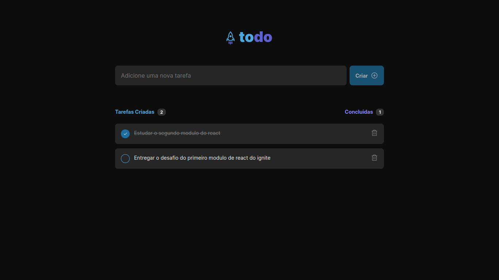

# Todo

## Descrição
Todo é o app criado como o primeiro dasafio do ignite da rocketseat.




## Status:
 - Terminado(v1)

## Ferramentas
- React
- vite
- css module

## Como usar

Faça o clone deste repositório em sua máquina.

```bash
    git clone https://github.com/Ramiro-Rfn/Desafio01-ignite.git

````

Instale as dependências rodando:
```bash
    yarn 

    //ou

    npm install
````

Rode o progecto:
```bash
    yarn dev
``